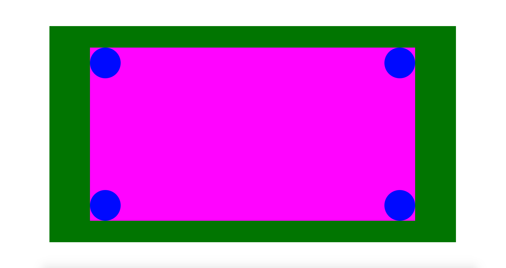
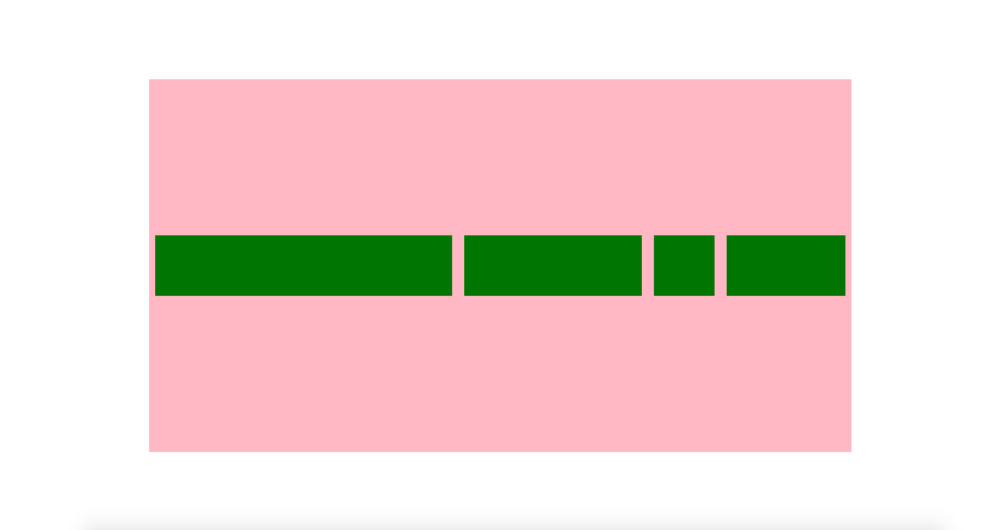
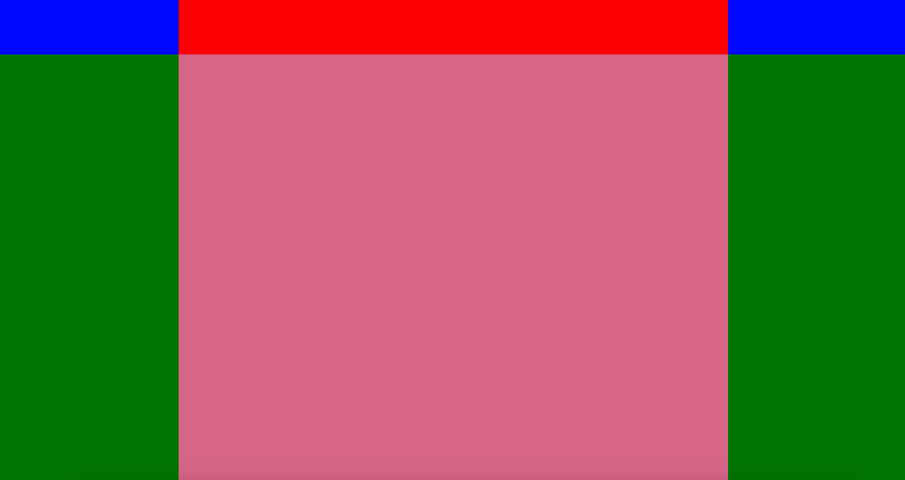
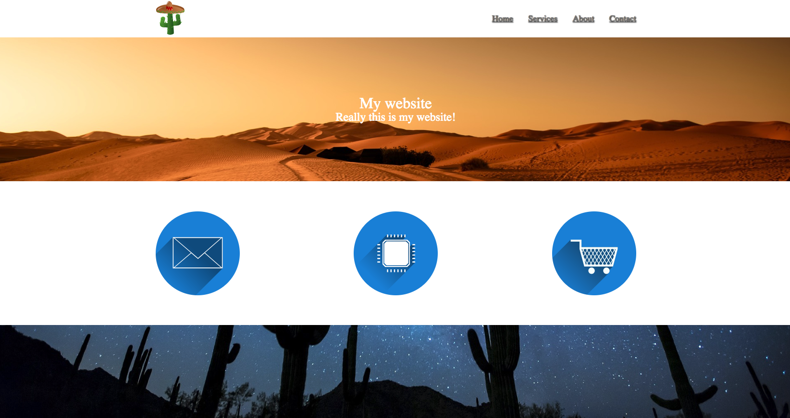

# HTML CSS day 2

## topics
<ol>
    <li>Position</li>
        <ul>
            <li>Absolute</li>
            <li>fixed</li>
            <li>relative</li>
            <li>static</li>
        </ul>
         
   <li>Flex</li>
        <ul>
            <li>justify-content</li>
            <li>align-items</li>
            <li>flex-direction</li>
            <li>flex (shorthand)</li>
            <li><a href="https://learnflexbox.org">Learnflexbox.org</a></li>
        </ul>
    
    <li>Double Container</li>
        <ul>
            <li>Show how many sites employ double container method</li>
            <li>Site Layout</li>
        </ul>
        
    <li>Mentions</li>
       <ul>
            <li>CSS reset vs Normalize</li>
            <li>Box-sizing:border-box</li>
       </ul>
    <li>Example site</li> 
    
This site employs the concepts we learned 

           
<ol>

## Afternoon Project
<li> Clone Your github profile page, no functionality just design